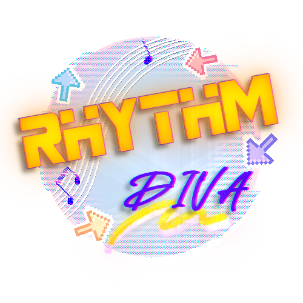
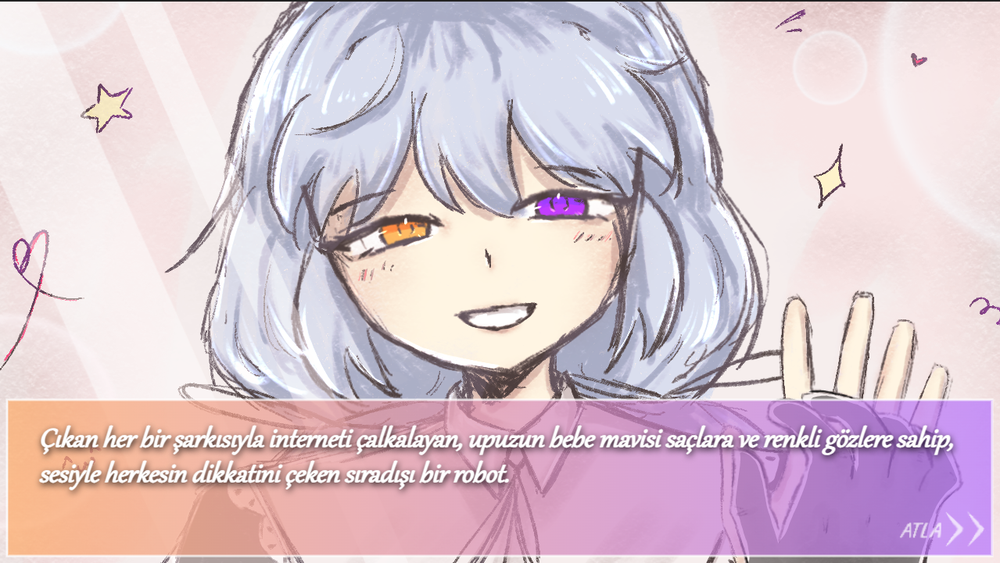
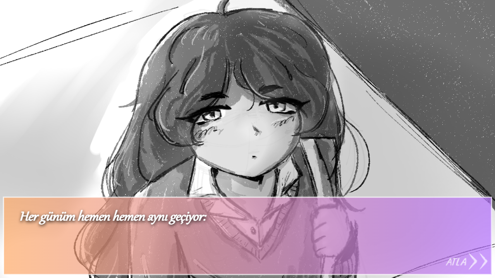
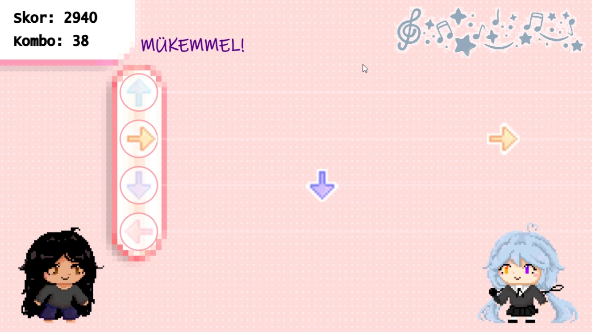

# RHYTHM DIVA ♫

### Rhythm Diva; **HTML5 Canvas** ve **JavaScript** kullanılarak geliştirilmiş, yarı Visual Novel (Görsel Roman) yarı ritim oyunu tadında, okul projem için sınırlı bir süre içerisinde tasarladığım bir oyundur.

---

## Özellikler

* **Ritme Göre Nota Oluşturma:** Şarkının vuruşlarına (BPM) göre otomatik hızlanan ve yavaşlayan nota üretim sistemi tasarlanmıştır. Gelen notalar her seferinde BPM'e göre **rastgele** oluşturulduğundan, oyun her yeniden başlatıldığında notaların gelme sırası da farklı olacaktır.
* **Hikaye:** Oyunun başında ve sonunda oyunun ana hikayesini anlatan Görsel Roman kısımları bulunmaktadır.
* **Skor Sistemi:** Kombo çarpanları, "Mükemmel", "Harika", "İyi" gibi vuruş hassasiyetleri ile oyun sonunda bir skor tablosu oluşturulur.
* **Sinematik Efektler:** Fade-in/Fade-out sahne geçişleri, ritimle senkronize dans eden arka plan karakterleri, tıklama ve sahne atlama gibi etkileşimlerle uyumlu ses efektleri gibi oynanışı daha da zevkli kılacak özellikler eklenmiştir.
* **Özgünlük:** Oyundaki bütün çizimler, karakter tasarımları ve hikaye **tamamen insan eliyle** düşünülmüş, çizilmiş ve yazılmıştır.

---

## Nasıl Oynanır

* Oyunun en başında gelen Visual Novel kısmı, ekranın herhangi bir yerine **Mouse ile tıklanılarak** ilerletilir. Eğer hikaye kısımlarını atlamak isterseniz sağ alt köşede bulunan *"ATLA"* butonuna da tıklayabilirsiniz. Hikaye kısmı bittikten sonra oyunun asıl kısmı olan ritim oyunu kısmına geçilecektir.

* Ritim oyunu başladığında şarkının ritmine göre sağdan sola doğru notalar akmaya başlar. Notalar tam **Hitline** (Hedef Çizgisi) üzerine geldiğinde klavyedeki ok tuşları kullanılarak notalara zamanında basılmalıdır.

* Skorlar tamamen zamanlamanın ne kadar iyi olduğuna göre verilir.

| Zamanlama | Puan |
|----------|----------|
| Mükemmel  | +100  |
| Harika  | +80 |
| İyi  | +50 |
| Kötü  | +0 |
| Iska  | -50 |

> Kötü ve Iska notalar komboyu sıfırlar.

> Her 50 komboda eklenen skorlar ikiye katlanır. *(Örneğin: 50 komboda Mükemmel +200, 100 komboda +400 gibi.)*

---

## "Nereden Oynayabilirim?"

* Oyun itch.io'da mevcut!! Hiç indirmeden web tarayıcınız üzerinden oynayabilirsiniz ^^
https://paprikagndz.itch.io/rhythm-diva

* (Alternatif) Aynı şekilde Github Pages üzerinden de yine indirmeden oynayabilirsiniz:
https://nursezakarakaya.github.io/Rhythm-Diva/

* Ama olur da "Oyunu illa da bilgisayarıma indirerek yerel dosya üzerinden oynamak istiyorum" derseniz:
  * Github'dan bu reponun tamamını bilgisayarınıza indirip zip dosyasını başka bir klasörün içine çıkartın.
  * Klasörün içinde bulunan `index.html` dosyasını istediğiniz bir tarayıcıda (Chrome, Firefox vb.) açın. (veya basitçe dosyaya çift tıklayın. Kendisi varsayılan tarayıcıda otomatik olarak açacaktır)

---

## Oyun Geliştirilirken Kullanılan Teknolojiler

* **Kodlama:** VS Code
* **Çizimler:** Ibis Paint X
* **Müzik ve Ses Efektlerini Editleme:** Movavi Video Editor 15 Plus
* ***Kod Yazımında Yardım:** ChatGPT ve Gemini

> *Projede yapay zekanın nasıl kullanıldığını görmek için [AI.md](AI.md) dosyasına göz atabilirsiniz. Daha önce de belirtildiği gibi, oyunun yaratıcılık gerektiren hiçbir kısımında yapay zekaya başvurulmamakla birlikte kod yazımında yapay zeka araçlarının kullanım şekli bu dosyada daha detaylı bir şekilde belirtilmiştir.

---

## Notlar
1. ***!!! Oyunda bulunan bütün çizimler bana aittir ve bunlar yapay zeka eğitmek veya satmak gibi amaçlarla kesinlikle kullanılamaz.***

2. Ritim oyununda sesteki gecikmeleri önlemek için bluetooth kulaklıklar yerine **kablolu** kulaklık kullanmanız tavsiye edilir.

---

## Krediler

* **Kullanılan Müzikler:**
  * i feel this is the best harmony ive ever written

  https://www.youtube.com/watch?v=plEw2WNkd9Y
  
  * iroha(sasaki) - Meltdown [HD Instrumental]

  https://www.youtube.com/watch?v=vAvosVciP4A

  * 【8-bit】inabakumori (feat. Kaai Yuki) - Lagtrain

  https://www.youtube.com/watch?v=d9dVy74hfbE

  * 【歌ってみた】フロートプレイ(Float Play) cover / 一色

  https://www.youtube.com/watch?v=B2UowDT19s8

* Projenin temel mekanikleri için esilenilen oyun ve gamejam(itch.io):
  * Oyun: (Cat got your tounge?) https://octobass.itch.io/cat-got-your-tongue
  * Jam: (Game off 2022) https://itch.io/jam/game-off-2022

---

### İyi eğlenceler :D !!! *-Paprika★* *2026*
